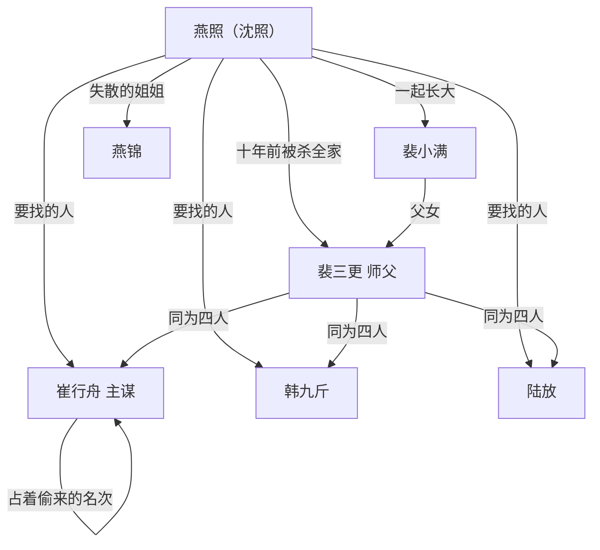

# 04 关系网与恩怨账

## 一张图

## 当年那一夜

十年前的十月初七，蒲州燕家二十七口一夜没了。

动手的是四个人。他们是北岭守碑堂同门的师兄弟，手背上同一天划的刀，疤是一样。

1. 裴三更（沈无咎）：执刀。他杀了最多的人。他在米缸里翻出十岁的孩子，没下手
2. 韩九斤：放火。他烧了东厢半间屋，屋里是燕家的拓本架子
3. 陆放：堵门。他守着后门，谁跑出来就砍谁。他砍过燕锦一下，没砍死
4. 崔行舟：主使。他没进门。他站在院外的车上等，等一样东西

那一样东西，就是燕家的拓本。

## 崔行舟为什么要燕家的命

天碑换过七回。第七回提前了。

旧碑上有一个位置，刻着一个死人的名字。那个人是那一代真正的名境，天下人都对着他那个位置行礼。他死了，位置该空着，一直空到下一次换碑。

第七回换碑那夜，旧碑碎，新碑立。新碑上那个位置刻的是「崔行舟」三个字。

那块旧碑上原来的名字，是个死人。

崔行舟拿了那个位置。他自己不到名境，二十年来，天下人对着他那个位置行礼。

燕家那本拓本里，有一页就是那块旧碑。拓在换碑之前。

## 恩怨账

这本账不给读者看，给作者记。每一笔都要在正文里兑现成一个动作。

| 谁 | 欠谁 | 欠什么 | 什么时候还 |
| --- | --- | --- | --- |
| 裴三更 | 燕照 | 一条命的说法，和十年的瞒 | 卷一末 |
| 裴三更 | 燕家 | 二十七条命里，有他下的手 | 卷三 |
| 崔行舟 | 北岭那个死人 | 偷来的名字 | 卷六 |
| 韩九斤 | 燕家 | 一把火，和十年的纸 | 卷三 |
| 陆放 | 燕锦 | 后门那一刀 | 卷三 |
| 裴小满 | 沈照 | 他右肩那道疤是为谁挨的 | 卷二 |
| 燕锦 | 沈照 | 她看见的那几页纸 | 卷二末 |
| 沈照 | 裴三更 | 十年饭钱，和一次收手 | 卷六 |
| 贺铸 | 沈照 | 当众压过他一次 | 卷四 |
| 郝石头 | 沈照 | 他爹那把旧刀 | 卷一末 |

## 关系怎么动

每一段关系都要经历三次翻面：

1. 认成什么样
2. 翻成什么样
3. 最后归成什么样

### 沈照与裴三更

1. 认成：师父和徒弟。十年饭，一把刀
2. 翻成：仇人和人质。刀顶在脖子上，谁也没下手
3. 归成：他把师父的刀埋了，没埋师父的人

### 沈照与裴小满

1. 认成：一起长大的两个人，谁先开口谁先输
2. 翻成：她爹是他仇人，她站在中间
3. 归成：她替他挡在父亲面前，他替她挡了山门

### 沈照与崔行舟

1. 认成：师叔和晚辈。崔行舟待他客气
2. 翻成：主谋和苦主。崔行舟要他死，要他手里的拓本
3. 归成：他没往碑顶刻自己，把崔行舟的名字从碑上刮下来

### 沈照与郝石头

1. 认成：白身跟白身，谁也不比谁高
2. 翻成：一个想上碑，一个只想活着
3. 归成：他替沈照挡在碑底下，沈照替他记了名字
| 崔行舟 | 天碑上那个死人 | 偷来的名次 | 卷六 |
