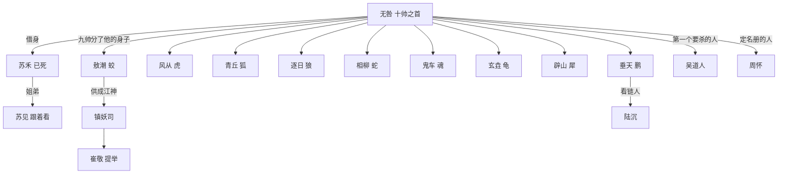

# 04 关系网与旧账

## 一张图

## 三千年前那一夜

妖皇死在深冬，死因不明。十帅在皇庭站了一夜。

天亮时九个动了手。他们是分头上的，谁先动的手，卷三才有人肯说。

封完之后，他们分了最强那个的身子，一人一件。分完，人族进了皇庭。九个刚动过手，没回元气，被一个一个封进山。

人族的锁借了妖族的旧法，锁芯就是那九件战利品。所以他们九个人，每个人都有两样东西押在锁上：自己，和自己拿的那一份。

**第十份是名号。**谁也没拿。拿不动。

## 九帅各自欠他什么

| 谁 | 拿了他哪一件 | 那一件现在被当什么用 | 什么时候收 |
| --- | --- | --- | --- |
| 敖潮 | 目 | 镇妖司正殿供像的座底 | 卷二 |
| 风从 | 骨 | 北荒牙帐的大梁 | 卷三 |
| 青丘 | 心 | 清徽宗后山丹炉里炼着 | 卷四 |
| 鬼车 | 影 | 妖皇坟里 | 卷五 |
| 逐日 | 血（当年灌进井里那罐剩的） | 狼庭祭坛 | 卷一末牵出，卷五收 |
| 相柳 | 部（号令） | 南疆，用来招旧部 | 卷四 |
| 辟山 | 甲 | 拆成十块，做了十座山碑 | 卷四起 |
| 玄垚 | 甲的一角 | 会宁城墙底下 | 卷三 |
| 垂天 | 没拿 | 那一夜他站在门外 | 卷三先找 |

## 关系怎么动

每段关系走三步：认成什么样、翻成什么样、归成什么样。

### 无咎与苏见

1. 认成：一个活人，一副死人的脸
2. 翻成：她替他补了鞋，转头把刀磨了三遍
3. 归成：卷二测妖那一场，她站到前头，说这是她弟

### 无咎与崔敬

1. 认成：一个查，一个让他查
2. 翻成：崔敬查到了上头不想让人查的那一层
3. 归成：卷五他把名册合上，不再问名字

### 无咎与风从

1. 认成：三千年的老兄弟，一个还在往上走，一个从头再来
2. 翻成：卷三动手。风从说他不能把骨还回去，还了他就散
3. 归成：卷六他站在无咎身后

### 无咎与青丘

1. 认成：一个上宗祖师，一个混进来的散修
2. 翻成：她认出了他，当众叫了一声旧号
3. 归成：卷四她退还「心」，条件是他不动她那座宗
