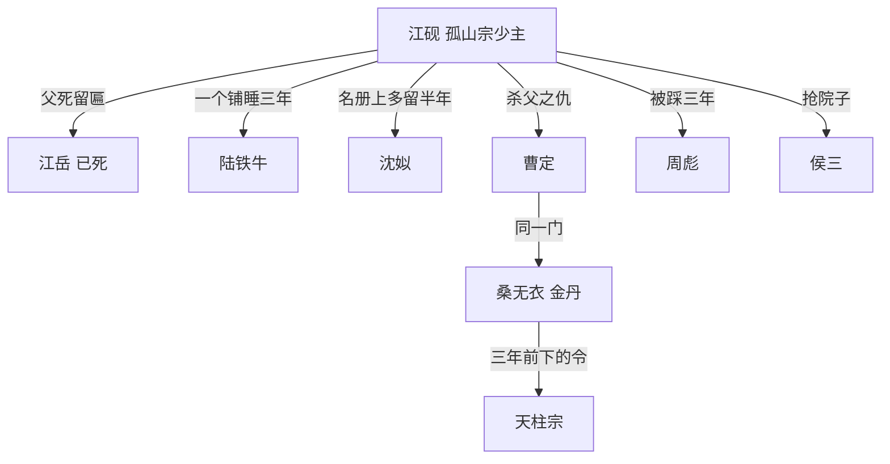

# 04 关系网与旧账

## 一张图

## 三年前那一夜

十月初三，天柱宗上孤山。

孤山宗上下四十三口。门里没有高手，掌门江岳真元后期，其余都是通脉往下。天柱宗来了三十人，金丹一个。

后半夜起的火。烧到天亮，山上没剩一间完整的屋。

江岳死之前做了两件事：把儿子塞进灶后的柴堆，掰下山门匾的一角，连着血塞进他怀里。

**尸首没找着。** 天柱宗报的是「四十三口，无活口」。

## 天柱宗为什么要那一夜

孤山半山腰那口灵泉。

泉不大，养不出高手，可它是青岩城方圆六十里唯一带灵气的活水。天柱宗的山上井水浑，药田要靠外头买水。

要那口泉，得先把泉的名字上那个主人抹掉。

## 三路旧账

| 谁 | 欠谁 | 欠什么 | 什么时候还 |
| --- | --- | --- | --- |
| 曹定 | 江砚 | 领路的那一晚，四十三口 | 卷三 |
| 桑无衣 | 江砚 | 一句令，一口泉 | 卷一末先收一半，卷六收完 |
| 周彪 | 江砚 | 三年的水，三年的手 | 第 1 章 |
| 天柱宗 | 孤山宗 | 一块匾，一本谱，一个名字 | 卷六 |

## 关系怎么动

每段关系走三步：认成什么样、翻成什么样、归成什么样。

### 江砚与铁牛

1. 认成：一个铺上的两个杂役，江砚替他挡过一次打
2. 翻成：江砚成了掌门，他成了第一个徒弟，也是第一个跪下的人
3. 归成：卷三他替江砚挡了一刀，江砚把他的名字刻在孤山宗的传度谱第一行

### 江砚与沈姒

1. 认成：管册子的人和名册上一行字
2. 翻成：她在册子上替他改了日子，被查出来，挨了三十鞭
3. 归成：卷一末她把册子带走，跟他下山

### 江砚与曹定

1. 认成：一个追，一个跑。曹定三年没找到那个孩子
2. 翻成：江砚的名字挂上了香火录，曹定认出了那半块匾
3. 归成：卷三孤山旧址，曹定死之前问他的名字，他报了

### 江砚与桑无衣

1. 认成：一个金丹长老，和一个连引气都没成的杂役
2. 翻成：卷一末，江砚把掌门印从桑无衣的架上抢下来，桑无衣第一次正眼看他
3. 归成：卷六，两人站在天柱宗山门下，谁的匾还挂着
