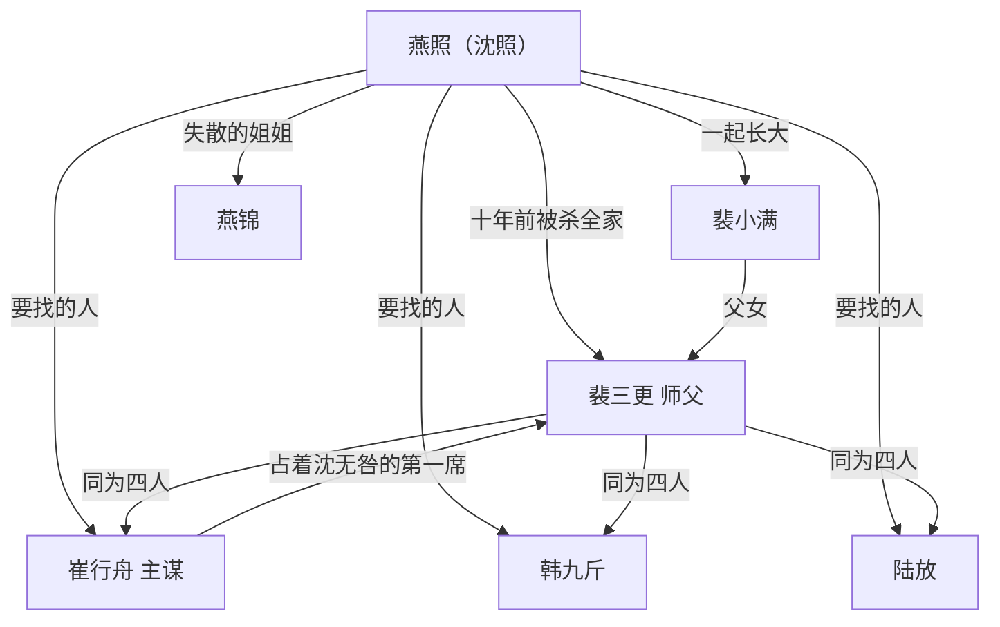

# 04 关系网与恩怨账

## 一张图

## 当年那一夜

十年前的十月初七，蒲州燕家二十七口一夜没了。

燕家世代给北岭绝顶那面榜刻字、拓榜。天下人以为那面榜是天写的，只有三山门的人和燕家知道，榜是刻出来的。别的人死了，名字还留在榜上，等到修榜。燕家的人死了，蒲州这一支就算断了，那本底册也就没人再提。

动手的是四个人。他们是北岭守榜堂同门的师兄弟，手背上同一天划的刀，疤是一样。

1. 沈无咎（后改名叫裴三更）：执刀。他是燕家的大徒弟，燕家的字是他一凿一凿学的。他杀了十个人，最后一个是他师父。他在米缸里翻出十岁的孩子，没下手
2. 韩九斤：放火。他烧了东厢半间屋，屋里是燕家放底册的架子
3. 陆放：堵门。他守着后门，谁跑出来就砍谁。他砍过燕锦一下，没砍死
4. 崔行舟：主使。他没进门。他站在院外的车上等，等一样东西

那一样东西，就是燕家的底册。

## 沈无咎是怎么被骗进去的

崔行舟跟他说：燕家私改底册，糊弄天下人，榜上第一席那个位子来路不正。

沈无咎是燕家的大徒弟，他一个字不信，也不得不亲自去看。他去了，他带了刀。等他看清楚，院子里已经没有活人了。

他要的东西，崔行舟要的东西，其实是同一样：沈无咎的名字。

崔行舟要第一席。

## 崔行舟为什么要燕家的命

十年前，榜首第一席上刻着三个字：沈无咎。他是那一代真正的名境，天下人都对着那个位子行礼。

按规矩，人死了名字不磨，留在榜上，一直等到修榜。修榜六十年一回。

那一年，修榜提前了。

旧壁从石台上卸下来，当面砸碎，碎片装车埋到后山。新壁立起来，第一席上刻的是崔行舟。

天下人以为沈无咎死了。榜上换了人，谁也看不出。

只有燕家那本底册记得，那三席原来刻的是谁。而记得这件事的人，那一夜全在院子里。

崔行舟拿那个位子坐了十年。他自己不到名境。这十年，天下人对着他那个位子行礼。

## 恩怨账

这本账不给读者看，给作者记。每一笔都要在正文里兑现成一个动作。

| 谁 | 欠谁 | 欠什么 | 什么时候还 |
| --- | --- | --- | --- |
| 裴三更 | 燕照 | 一条命的说法，和十年的瞒 | 卷一末 |
| 裴三更 | 燕家 | 二十七条命里，有他下的手 | 卷三 |
| 崔行舟 | 沈无咎 | 偷来的第一席 | 卷六 |
| 韩九斤 | 燕家 | 一把火，和十年的纸 | 卷三 |
| 陆放 | 燕锦 | 后门那一刀 | 卷三 |
| 裴小满 | 沈照 | 她右肩那道疤是为谁挨的 | 卷二 |
| 燕锦 | 沈照 | 她看见的那卷纸 | 卷二末 |
| 沈照 | 裴三更 | 十年饭钱，和一次收手 | 卷六 |
| 贺铸 | 沈照 | 当众压过他一次 | 卷四 |
| 郝石头 | 沈照 | 他爹那把旧刀 | 卷一末 |

## 关系怎么动

每一段关系都要经历三次翻面：

1. 认成什么样
2. 翻成什么样
3. 最后归成什么样

### 沈照与裴三更

1. 认成：师父和徒弟。十年饭，一把刀
2. 翻成：仇人和人质。刀顶在脖子上，谁也没下手
3. 归成：他把师父的刀埋了，没埋师父的人

### 沈照与裴小满

1. 认成：一起长大的两个人，谁先开口谁先输
2. 翻成：她爹是他仇人，她站在中间
3. 归成：她替他挡在父亲面前，他替她挡了山门

### 沈照与崔行舟

1. 认成：师叔和晚辈。崔行舟待他客气
2. 翻成：主谋和苦主。崔行舟要他死，要他手里的底册
3. 归成：他没往第一席刻自己，把崔行舟那三个字从榜上削了下来

### 沈照与郝石头

1. 认成：无名跟无名，谁也不比谁高
2. 翻成：一个想上榜，一个只想活着
3. 归成：他替沈照挡在石台底下，沈照把他的名字刻了上去
